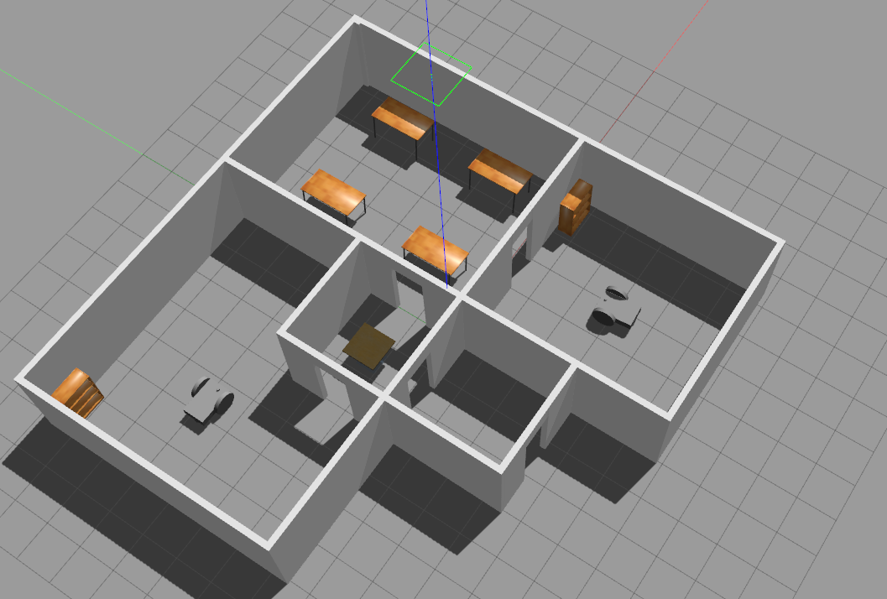

# Build Robot World
The **Build-Robot-World** lab part of RoboND Gazebo Basics lesson.

### Directory Structure
```
                               
    ├── images                                           
    │   ├── output_0.png
    ├── model                          
    │   ├── mobile_robot
    │   │   ├── model.config
    │   │   ├── model.sdf
    │   ├── robotBuilding
    │   │   ├── model.config
    │   │   ├── model.sdf
    ├── script                              
    │   ├── robotPlugin.cpp
    ├── world                          
    │   ├── roboWorld
    ├── CMakeLists.txt                  
    └──                              
```

### Steps to launch the simulation


#### Step 1 Clone the lab folder in /home/workspace/
```
$ git clone git@github.com:m-loay/Build-Robot-World.git
```

#### Step 2 Compile the code
```
$ mkdir build
$ cd build/
$ cmake ../
$ make
```

#### Step 3 Add the library path to the Gazebo plugin path  
```
$ export GAZEBO_PLUGIN_PATH=${GAZEBO_PLUGIN_PATH}:${PWD}
```

#### Step 5 Run the Gazebo World file  
```
$ gazebo roboWorld
```

### Output
The hello world message and the two-wheeled robot inside a Gazebo World should both launch as follow: 




 ## Project Rubric  
 ### 1. Basic Requirements  
 #### 1.1 Does the project include a world directory containing the Gazebo world file, a model directory containing a structure and an object model files, a script directory containing the C++ plugin code, and a CMakeLists.txt file?  
 Done.  
 ### 2. Building  
 #### 2.1 Does the project include a house with walls?  
 Done.  
 ### 3. Modeling  
 #### 3.1 Does the project include an object built using the Model Editor?  
 Done.  
 ### 4. Gazebo World  
 #### 4.1 Does the project contain a Gazebo world with multiple models?  
 Done.    
 ### 5. World Plugin  
 #### 5.1 Does the project contain a C++ world plugin?  
 Done.  

